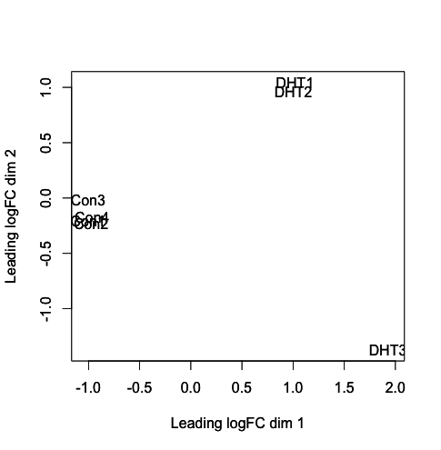
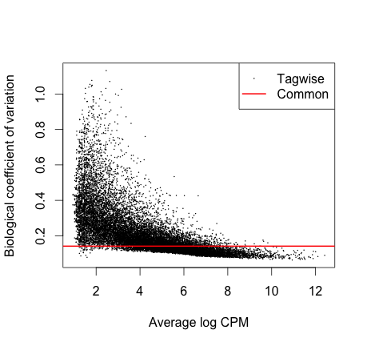

Key Learning Outcomes
---------------------

After completing this practical the trainee should be able to:

-   Understand and perform a two condition RNA-Seq expression analysis workflow.

-   Perform spliced alignments to an indexed reference genome using
    TopHat.

-   Visualize spliced transcript alignments in a genome browser such as
    IGV.

-   Be able to identify differential gene expression between two
    experimental conditions.


We also have bonus exercises where you can learn to:

-   Perform transcript assembly using Stringtie.

    analysis.

-   Visualize transcript alignments and annotation in a genome browser
    such as IGV.


## Author Information

*Primary Author(s):*
Sonika Tyagi, Monash University and  Susan Corley, UNSW

*Contributor)s)*
Myrto Kostadima EBI UK

Resources You’ll be Using
-------------------------

### Tools Used

Tophat
:   <https://ccb.jhu.edu/software/tophat/index.shtml>

Stringtie
:  <http://https://ccb.jhu.edu/software/stringtie/>

Samtools
:    <http://www.htslib.org/>

BEDTools
:   <https://github.com/arq5x/bedtools2>

UCSC tools
:    <http://hgdownload.cse.ucsc.edu/admin/exe/>

IGV
:   <http://www.broadinstitute.org/igv/>

FeatureCount
:    <http://subread.sourceforge.net/>

edgeR pakcage
:    <https://bioconductor.org/packages/release/bioc/html/edgeR.html>


### Sources of Data

<http://www.ebi.ac.uk/ena/data/view/ERR022484>\
<http://www.ebi.ac.uk/ena/data/view/ERR022485>\
<http://www.pnas.org/content/suppl/2008/12/16/0807121105.DCSupplemental>

Introduction
------------

The goal of this hands-on session is to perform some basic tasks in the
downstream analysis of RNA-seq data.\

First we will use RNA-seq data from zebrafish. You will align one set of
reads to the zebrafish using Tophat2. You will then view the aligned
reads using the IGV viewer. We will also demonstrate how gene counts can
be derived from this data. You will go on to assembly a transcriptome
from the read data using cufflinks. We will show you how this type of
data may be analysed for differential expression.

The second part of the tutorial will focus on RNA-seq data from a human
experiment (cancer cell line versus normal cells). You will use the
Bioconductor packages edgeR and voom (limma) to determine differential
gene expression. The results from this analysis will then be used in the
final session which introduces you to some of the tools used to gain
biological insight into the results of a differential expression
analysis

Prepare the Environment
-----------------------

We will use a dataset derived from sequencing of mRNA from `Danio rerio`
embryos in two different developmental stages. Sequencing was performed
on the Illumina platform and generated 76bp paired-end sequence data
using polyA selected RNA. Due to the time constraints of the practical
we will only use a subset of the reads.

The data files are contained in the subdirectory called `data` and are
the following:

`2cells_1.fastq` and `2cells_2.fastq`
:   \
    These files are based on RNA-seq data of a 2-cell zebrafish embryo

`6h_1.fastq` and `6h_2.fastq`
:   \
    These files are based on RNA-seq data of zebrafish embryos 6h post
    fertilization

Open the Terminal and go to the `rnaseq` working directory:

```shell 
cd /home/trainee/rnaseq/ 
```

All commands entered into the terminal for this tutorial should be from
within the **`/home/trainee/rnaseq`** directory.

Check that the `data` directory contains the above-mentioned files by
typing:

 ```shell
 ls data
```


Alignment
---------

There are numerous tools for performing short read alignment and the
choice of aligner should be carefully made according to the analysis
goals/requirements. Here we will use Tophat2, a widely used ultrafast
aligner that performs spliced alignments.

Tophat2 is based on the Bowtie2 aligner and uses an indexed genome for
the alignment to speed up the alignment and keep its memory footprint
small. The the index for the `Danio rerio` genome has been created for
you.

The command to create an index is as follows. You DO NOT need to run
this command yourself - we have done this for you.

```diff
 - bowtie2-build genome/Danio_rerio.Zv9.66.dna.fa genome/ZV9
```
Tophat2 has a number of parameters in order to perform the alignment. To
view them all type:

```shell
tophat2 --help
```

The general format of the tophat2 command is:

```shell
tophat2 [options]* <index_base> <reads_1> <reads_2>
```

Where the last two arguments are the `.fastq` files of the paired end
reads, and the argument before is the basename of the indexed genome.

The quality values in the FASTQ files used in this hands-on session are
Phred+33 encoded. We explicitly tell tophat of this fact by using the
command line argument `–solexa-quals`.

You can look at the first few reads in the file `data/2cells_1.fastq`
with:

```shell
head -n 20 data/2cells_1.fastq
```
Some other parameters that we are going to use to run Tophat are listed
below:

-p `-g` : Maximum number of multihits allowed. Short reads are likely to map
    to more than one location in the genome even though these reads can
    have originated from only one of these regions. In RNA-seq we allow
    for a limited number of multihits, and in this case we ask Tophat to
    report only reads that map at most onto 2 different loci.
- `–library-type`:   Before performing any type of RNA-seq analysis you need to know a
    few things about the library preparation. Was it done using a
    strand-specific protocol or not? If yes, which strand? In our data
    the protocol was NOT strand specific.

- `-j`:   Improve spliced alignment by providing Tophat with annotated splice
    junctions. Pre-existing genome annotation is an advantage when
    analysing RNA-seq data. This file contains the coordinates of
    annotated splice junctions from Ensembl. These are stored under the
    sub-directory `annotation` in a file called `ZV9.spliceSites`.

- `-o`:  This specifies in which subdirectory Tophat should save the output
    files. Given that for every run the name of the output files is the
    same, we specify different directories for each run.

It takes some time (approx. 20 min) to perform tophat spliced
alignments, even for this subset of reads. Therefore, we have
pre-aligned the `2cells` data for you using the following command:

You **DO NOT** need to run this command yourself - we have done this for
you.

```bash
tophat2 --solexa-quals -g 2 --library-type fr-unstranded -j annotation/Danio_rerio.Zv9.66.spliceSites -o tophat/ZV9_2cells genome/ZV9 data/2cells_1.fastq data/2cells_2.fastq
```

Align the `6h` data yourself using the following command:

```shell
    # Takes approx. 20mins
    tophat2 --solexa-quals -g 2 --library-type fr-unstranded -j annotation/Danio_rerio.Zv9.66.spliceSites -o tophat/ZV9_6h genome/ZV9 data/6h_1.fastq data/6h_2.fastq
```

The `6h` read alignment will take approx. 20 min to complete. Therefore,
we’ll take a look at some of the files, generated by tophat, for the
pre-computed `2cells` data.

Tophat generates several files in the specified output directory. The
most important files are listed below.

`accepted_hits.bam`
:   This file contains the list of read alignments in BAM format.

`align_summary.txt`
:   Provides a detailed summary of the read-alignments.

`unmapped.bam`
:   This file contains the unmapped reads.

The complete documentation can be found at:
<https://ccb.jhu.edu/software/tophat/manual.shtml>
### Alignment Visualisation in IGV

The Integrative Genomics Viewer (IGV) is able to provide a visualisation
of read alignments given a reference sequence and a BAM file. We’ll
visualise the information contained in the `accepted_hits.bam` and
`junctions.bed` files for the pre-computed `2cells` data. The former,
contains the tophat spliced alignments of the reads to the reference
while the latter stores the coordinates of the splice junctions present
in the data set.

Open the `rnaseq` directory on your Desktop and double-click the
`tophat` subdirectory and then the `ZV9_2cells` directory.

1.  Launch IGV by double-clicking the “IGV 2.3.\*” icon on the Desktop
    (ignore any warnings that you may get as it opens). *NOTE: IGV may
    take several minutes to load for the first time, please be patient.*

2.  Choose “Zebrafish (Zv9)” from the drop-down box in the top left of
    the IGV window. Else you can also load the genome fasta file.

3.  Load the `accepted_hits.sorted.bam` file by clicking the “File”
    menu, selecting “Load from File” and navigating to the
    `Desktop/rnaseq/tophat/ZV9_2cells` directory.

4.  Rename the track by right-clicking on its name and choosing “Rename
    Track”. Give it a meaningful name like “2cells BAM”.

5.  Load the `junctions.bed` from the same directory and rename the
    track “2cells Junctions BED”.

6.  Load the Ensembl annotations file `Danio_rerio.Zv9.66.gtf` stored in
    the `rnaseq/annotation` directory.

7.  Navigate to a region on chromosome 12 by typing
    `chr12:20,270,921-20,300,943` into the search box at the top of the
    IGV window.

Keep zooming to view the bam file alignments

Some useful IGV manuals can be found below

<http://www.broadinstitute.org/software/igv/interpreting_insert_size>\
<http://www.broadinstitute.org/software/igv/alignmentdata>

Does the file ’align\_summary.txt’ look interesting? What information
does it provide?

As the name suggests, the file provides a details summary of the
alignment statistics.

One other important file is ’unmapped.bam’. This file contains the
unampped reads.

Can you identify the splice junctions from the BAM file?

Splice junctions can be identified in the alignment BAM files. These are
the aligned RNA-Seq reads that have skipped-bases from the reference
genome (most likely introns).

Are the junctions annotated for `CBY1` consistent with the annotation?

Read alignment supports an extended length in exon 5 to the gene model
(cby1-001)

Once tophat finishes aligning the 6h data you will need to sort the
alignments found in the BAM file and then index the sorted BAM file.

```bash
samtools sort tophat/ZV9_6h/accepted_hits.bam tophat/ZV9_6h/accepted_hits.sorted
samtools index tophat/ZV9_6h/accepted_hits.sorted.bam
```

Load the sorted BAM file into IGV, as described previously, and rename
the track appropriately.

### Generating Gene Counts

In RNAseq experiments the digital gene expression is recorded as the
gene counts or number of reads aligning to a known gene feature. If you
have a well annotated genome, you can use the gene structure file in a
standard gene annotation format (GTF or GFF)) along with the spliced
alignment file to quantify the known genes. We will demonstrate a
utility called `FeatureCounts` that comes with the `Subread` package.

```bash
mkdir gene_counts
featureCounts -a annotation/Danio_rerio.Zv9.66.gtf -t exon -g gene_id -o gene_counts/gene_counts.txt tophat/ZV9_6h/accepted_hits.sorted.bam tophat/ZV9_2cells/accepted_hits.sorted.bam
```

Isoform Expression and Transcriptome Assembly
---------------------------------------------

For non-model organisms and genomes with draft assemblies and incomplete
annotations, it is a common practice to take and assembly based approach
to generate gene structures followed by the quantification step. There
are a number of reference based transcript assemblers available that can
be used for this purpose such as, cufflinks, stringtie. These assemblers
can give gene or isoform level assemblies that can be used to perform a
gene/isoform level quantification. These assemblers require an alignment
of reads with a reference genome or transcriptome as an input. The
second optional input is a known gene structure in `GTF` or `GFF`
format.

These gene annotation files contain information of known genes and may be helpful in reconstruction of transcripts that are of low abundance on your sample. StringTie will also assemble and construct a transcriptome containing any unannotated genes. Furthermore, its output data is able to directly be utilised in differential expression resources such as Cuffdiff, Ballgown or other packers in R (edgeR, DESeq2).

To run string tie, the basic command is:


Stringtie has a number of parameters in order to perform transcriptome
assembly and quantification. To view them all type:

    stringtie --help

We aim to reconstruct the transcriptome for both samples by using the
Ensembl annotation as a guide. 

The Ensembl annotation for `Danio rerio` is available in
`annotation/Danio_rerio.Zv9.66.gtf`.

The general format of the `stringtie` command is:

    stringtie <aligned_reads_file.bam> [options]

Where the input is the aligned reads (either in SAM or BAM format).

Perform transcriptome assembly, strictly using the supplied GTF
annotations, for the `2cells` and `6h` data using cufflinks:

For instance, to run StringTie on 2cells BAM file:

    stringtie -p 8 -G annotation/Danio_rerio.Zv9.66.gtf -o stringtie/ZV9_2cells.gft tophat/ZV9_2cells/accepted_hits.sorted.bam

 

Repeat this command on the 6h BAM file:

    stringtie -p 8 -G annotation/Danio_rerio.Zv9.66.gtf -o stringtie/ZV9_6h.gft tophat/ZV9_6h/accepted_hits.sorted.bam

:	-p = number of processing threads

:	-G = reference annotation file

:	-o = output file location and name.

 

Most RNA sequencing experiments will have multiple samples. As such, Stringtie has a function to merge all transcripts assembled across the samples, which enables inter-sample comparisons to be made. It does this by first assembling all transcripts within each sample, merging the the transcripts and re-running the assembly based off a merged list of genes.

 

Prior to running a merge function within stringtie:
We need to create a mergelist.txt file before utilising the merge function. This is a list of all .gtf files created by stringtie in the above step and can be made in a text editor such as vi or nano. For this exercise, there is a file pre-made for you. The txt file will direct the merge function to look for the names of all the .gtf files that we want to merge.

 

To merge StringTie files

    ls stringtie/*.gtf >mergelist.txt
    less mergelist.txt 

    stringtie --merge -p 8 -G annotation/Danio_rerio.Zv9.66.gtf -o stringtie/stringtie_merged.gtf mergelist.txt

(mergelist.txt is a text file that will have a list of all .gtf generated by stringtie in the above steps)

Note how a reference gene annotation (Danio_rerio.Zv9.66.gtf) is utilised in this case. This makes use of information we already have in order to assemble the transcriptome of our RNA seq data.

 

The next step is an optional step to see how your merged annotation compares to reference gene annotation provided. gffcompare is a tool that determines how many of your annotations match the reference (either fully or partial) and how many were completely novel. The output of this ulitily gives you:

Sensitivity is defined as the proportion of genes from the annotation that are correctly reconstructed
Precision (also known as positive predictive value) captures the proportion of the output that overlaps the annotation
To compare how merged annotation compares to reference

    gffcompare -G -r annotation/Danio_rerio.Zv9.66.gtf stringtie/stringtie_merged.gtf

:	-r = reference genome in form of gtf

:	-G = tells gffcompare to compare all transcripts in the input file (stringtie/stringtie_merged.gtf), even those that might be redundant

:	-o = all output of gffcompare has a gffcmp. prefix, unless otherwise defined by user

  

Now that we are happy with our merged annotation, we need to estimate the abundance of each transcript within each sample. Stringtie is designed to create output files that are immediately usable in next step of our RNA sequencing pipeline. In this next example, we can direct stringtie to simultaneously create a .ctab file required for ballgown.

 
To estimate abundances and create table counts for 2cell 

    stringtie -e -B -p 8 -G stringtie/stringtie_merged.gtf -o ballgown/ZV9_6h.gtf tophat/ZV9_6h/accepted_hits.sorted.bam

To estimate abundances and create table counts for 2cell 

    stringtie -e -B -p 8 -G stringtie/stringtie_merged.gtf -o ballgown/ZV9_2cells.gtf tophat/ZV9_2cells/accepted_hits.sorted.bam

:	-e = limits the processing of read alignments to only estimate and output the assembled transcripts matching the reference transcripts (given by -G). Reads with no reference transcripts will be entirely skipped

:	-B = enables output of Ballgown input table files (*.ctab) containing coverage data for the reference transcripts given with the -G option. If -o is used,  StringTie will write the *.ctab files in the same directory as the output GTF.      

:	-p = refers to number of processing threads

:	-G = refers to a reference annotation (in GTF or GFF format)


Visulaizing transcript assembly
-------------------------------

1.  Go back to IGV and load the pre-computed, GTF-guided transcriptome
    assembly for the `2cells` data
    (`stringtie/ZV9_2cells.gtf`).

2.  Rename the track as “2cells GTF-Guided Transcripts”.

3.  In the search box type `ENSDART00000082297` in order for the browser
    to zoom in to the gene of interest.

Do you observe any difference between the Ensembl GTF annotations and
the GTF-guided transcripts assembled by cufflinks (the “2cells
GTF-Guided Transcripts” track)?

Yes. It appears that the Ensembl annotations may have truncated the last
exon. However, our data also doesn’t contain reads that span between the
last two exons.

Differential Gene Expression Analysis using edgeR
-------------------------------------------------

### Experiment Design

The example we are working through today follows a case Study set out in
the edgeR Users Guide (4.3 Androgen-treated prostate cancer cells
(RNA-Seq, two groups) which is based on an experiment conducted by Li et
al. (2008, Proc Natl Acad Sci USA, 105, 20179-84).

The researches used a prostate cancer cell line (LNCaP cells). These
cells are sensitive to stimulation by male hormones (androgens). Three
replicate RNA samples were collected from LNCaP cells treated with an
androgen hormone (DHT). Four replicates were collected from cells
treated with an inactive compound. Each of the seven samples was run on
a lane (7 lanes) of an Illumina flow cell to produce 35 bp reads. The
experimental design was therefore:


**Lane** | **Treatment** | **Label**|
1 | Control | Con1|
2 | Control | Con2|
3 | Control | Con3|
4 | Control | Con4|
5 | DHT | DHT1|
6 | DHT | DHT2|
7 | DHT | DHT3|

This workflow requires raw gene count files and these can be generated
using a utility called featureCounts as demonstrated above. We are using
a pre-computed gene counts data (stored in `pnas_expression.txt`) for
this exercise.

### Prepare the Environment

Prepare the environment and load R:

```
    cd /home/trainee/rnaseq/edgeR
    R (press enter)
```
Once on the R prompt. Load libraries:
```
    library(edgeR)
    library(biomaRt)
    library(gplots)
    library("limma")
    library("RColorBrewer")
    library("org.Hs.eg.db")
```
### Read in Data

Read in count table and experimental design:
```
    data <- read.delim("pnas_expression.txt", row.names=1, header=T)
    targets <- read.delim("Targets.txt", header=T)
    colnames(data) <-targets$Label
    head(data, n=20)
```
### Add Gene annotation

The data set only includes the Ensembl gene id and the counts. It is
useful to have other annotations such as the gene symbol and entrez id.
Next we will add in these annotations. We will use the BiomaRt package
to do this.

We start by using the useMart function of BiomaRt to access the human
data base of ensemble gene ids.
```
    human<-useMart(host="www.ensembl.org", "ENSEMBL_MART_ENSEMBL", dataset="hsapiens_gene_ensembl") attributes=c("ensembl_gene_id", "entrezgene_id","hgnc_symbol")
```
We create a vector of our ensemble gene ids.
```
    ensembl_names<-rownames(data)
    head(ensembl_names)
```
We then use the function getBM to get the gene symbol data we want.This
takes about a minute.
```
    genemap<-getBM(attributes, filters="ensembl_gene_id", values=ensembl_names, mart=human)
```
Have a look at the start of the genemap dataframe.
```
    head(genemap)
```
We then match the data we have retrieved to our dataset.
```
    idx <-match(ensembl_names, genemap$ensembl_gene_id)
    data$entrezgene <-genemap$entrezgene_id [ idx ]
    data$hgnc_symbol <-genemap$hgnc_symbol [ idx ]
    Ann <- cbind(rownames(data), data$hgnc_symbol, data$entrezgene)
    colnames(Ann)<-c("Ensembl", "Symbol", "Entrez")
    Ann<-as.data.frame(Ann)
```
Let’s check and see that this additional information is there.
```
    head(data)
```
### Data checks

Create DGEList object:
```
    treatment <-factor(c(rep("Control",4), rep("DHT",3)), levels=c("Control", "DHT"))
    y <-DGEList(counts=data[,1:7], group=treatment, genes=Ann)
```
Check the dimensions of the object:
```
    dim(y)
```
We see we have 37435 rows (i.e. genes) and 7 columns (samples).

Now we will filter out genes with low counts by only keeping those rows
where the count per million (cpm) is at least 1 in at least three
samples:
```
    keep <-rowSums( cpm(y)>1) >=3
    y <- y[keep, ]
```
How many rows (genes) are retained now

`dim(y)` would give you 16494

How many genes were filtered out?

do 37435-16494.

As we have removed the lowly expressed genes the total number of counts
per sample has not changed greatly. Let us check the total number of
reads per sample in the original data (data) and now after filtering.

Before:
```
    colSums(data[,1:7])
    After filtering:
    colSums(y$counts)
```
We will now perform normalization to take account of different library
size:
```
    y<-calcNormFactors(y)
```
We will check the calculated normalization factors:
```
    y$samples
```
Lets have a look at whether the samples cluster by condition. (You
should produce a plot as shown in Figure 4):

    plotMDS(y, col=as.numeric(y$samples$group))

[H]  [fig:MDS plot]

Does the MDS plot indicate a difference in gene expression between the
Controls and the DHT treated samples?

The MDS plot shows us that the controls are separated from the DHT
treated cells. This indicates that there is a difference in gene
expression between the conditions.

We will now estimate the dispersion. We start by estimating the common
dispersion. The common dispersion estimates the overall Biological
Coefficient of Variation (BCV) of the dataset averaged over all genes.

By using verbose we get the Disp and BCV values printed on the screen

    y <- estimateCommonDisp(y, verbose=T)

What value to you see for BCV?

We now estimate gene-specific dispersion.

    y <- estimateTagwiseDisp(y) 

We will plot the tagwise dispersion and the common dispersion (You
should obtain a plot as shown in the Figure 5):

    plotBCV(y)

[H]  [fig:BCV plot]

We see here that the common dispersion estimates the overall Biological
Coefficient of Variation (BCV) of the dataset averaged over all genes.
The common dispersion is `0.02` and the BCV is the square root of the
common dispersion (sqrt[0.02] = 0.14). A BCV of 14% is typical for cell
line experiment.

As you can see from the plot the BCV of some genes (generally those with
low expression) can be much higher than the common dispersion. For
example we see genes with a reasonable level of expression with tagwise
dispersion of 0.4 indicating 40% variation between samples.

If we used the common dispersion for these genes instead of the tagwise
dispersion what effect would this have?

If we simply used the common dispersion for these genes we would
underestimate biological variability, which in turn affects whether
these genes would be identified as being differentially expressed
between conditions.It is recommended to use the tagwise dispersion,
which takes account of gene-to-gene variability.

Now that we have normalized our data and also calculated the variability
of gene expression between samples we are in a position to perform
differential expression testing.As this is a simple comparison between
two conditions, androgen treatment and placebo treatment we can use the
exact test for the negative binomial distribution (Robinson and Smyth,
2008).

### Testing for Differential Expression

We now test for differentially expressed BCV genes:
```
    et <- exactTest(y)
```
Now we will use the topTags function to adjust for multiple testing. We
will use the Benjimini Hochberg ("BH") method and we will produce a
table of results:
```
    res <- topTags(et, n=nrow(y$counts), adjust.method="BH")$table
```
Let’s have a look at the first rows of the table:

    head(res)

To get a summary of the number of differentially expressed genes we can
use the decideTestsDGE function.
```
    summary(de <- decideTestsDGE(et))
```
This tells us that 2096 genes are downregulated and 2339 genes are
upregulated at 5% FDR.We will now make subsets of the most significant
upregulated and downregulated genes.

    alpha=0.05
    lfc=1.5
    edgeR_res_sig<-res[res$FDR<alpha,]
    edgeR_res_sig_lfc <-edgeR_res_sig[abs(edgeR_res_sig$logFC) >= lfc,]head(edgeR_res_sig, n=20)nrow(edgeR_res_sig)nrow(edgeR_res_sig_lfc)

We can write out these results to our current directory.

    write.table(edgeR_res_sig , "edgeR_res_sig.txt", sep="\t", col.names=NA, quote=F)
    write.table(edgeR_res_sig_lfc , "edgeR_res_sig_lfc.txt", sep="\t", col.names=NA, quote=F)

How many differentially expressed genes are there?

4435

How many upregulated genes and downregulated genes do we have?

2339 2096

    q()

You can save your workspace by typing `Y` on prompt.

Please note that the output files you are creating are saved in your
present working directory. If you are not sure where you are in the file
system try typing `pwd` on your command prompt to find out.


References
----------

1.  Trapnell, C., Pachter, L. & Salzberg, S. L. TopHat: discovering
    splice junctions with RNA-Seq. Bioinformatics 25, 1105-1111 (2009).

2.  Trapnell, C. et al. Transcript assembly and quantification by
    RNA-Seq reveals unannotated transcripts and isoform switching during
    cell differentiation. Nat. Biotechnol. 28, 511-515 (2010).

3.  Langmead, B., Trapnell, C., Pop, M. & Salzberg, S. L. Ultrafast and
    memory-efficient alignment of short DNA sequences to the human
    genome. Genome Biol. 10, R25 (2009).

4.  Roberts, A., Pimentel, H., Trapnell, C. & Pachter, L. Identification
    of novel transcripts in annotated genomes using RNA-Seq.
    Bioinformatics 27, 2325-2329 (2011).

5.  Roberts, A., Trapnell, C., Donaghey, J., Rinn, J. L. & Pachter, L.
    Improving RNA-Seq expression estimates by correcting for fragment
    bias. Genome Biol. 12, R22 (2011).

6.  Robinson MD, McCarthy DJ and Smyth GK. edgeR: a Bioconductor package
    for differential expression analysis of digital gene expression
    data. Bioinformatics, 26 (2010).

7.  Robinson MD and Smyth GK Moderated statistical tests for assessing
    differences in tag abundance. Bioinformatics, 23, pp. -6.

8.  Robinson MD and Smyth GK (2008). Small-sample estimation of negative
    binomial dispersion, with applications to SAGE data.” Biostatistics,
    9.

9.  McCarthy, J. D, Chen, Yunshun, Smyth and K. G (2012). Differential
    expression analysis of multifactor RNA-Seq experiments with respect
    to biological variation. Nucleic Acids Research, 40(10), pp. -9.

